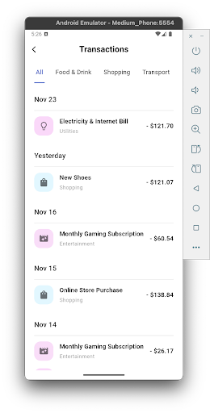
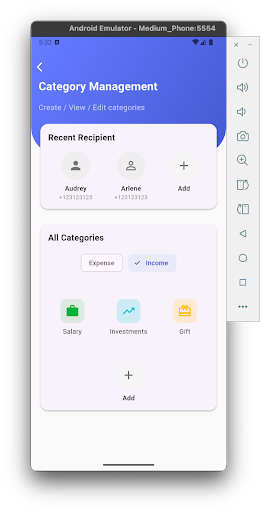

# 💰 SpendWise - Personal Expense Tracker

**SpendWise** is a comprehensive mobile application built with **Flutter** designed to help users track their daily income and expenses. With a focus on data visualization and ease of use, SpendWise allows you to manage your budget, create custom categories, and view detailed analytics of your financial health.

## Video Presentation
[Video](https://drive.google.com/file/d/1Av1zjfp_gLM5S6mqHoNkIqNhp-qDqIa-/view?usp=sharing](https://drive.google.com/file/d/16fcm6bohLDVizipGkixI3DJGHLhKgGWb/view?usp=sharing)

## 📱 Screenshots

| Dashboard & Charts | Add Transaction | Manage Categories |
|:---:|:---:|:---:|
|  |  |  |
## ✨ Key Features

* **📊 Interactive Dashboard:** * Visualizes financial data using **Bar Charts** (powered by `fl_chart`) with filters for Day, Month, and Year.
    * **Pie Charts** providing insights into your Top 5 spending categories.
    * Real-time summaries of Total Income, Total Expenses, and Net Balance.
* **📝 Transaction Management:** * Add, Edit, and Delete income and expense records.
    * Add notes and dates to every transaction.
* **🏷️ Advanced Category System:** * Create custom categories for Income or Expense.
    * **Custom Color Picker:** Select generic colors or input specific Hex codes.
    * **Icon Selector:** Choose from a variety of icons to personalize categories.
* **💾 Local Persistence:** * Built on **SQLite** (`sqflite`), ensuring your data is stored securely on your device and works offline.
* **🔄 Automatic Mock Data:** * The app automatically generates realistic sample data upon first launch for testing purposes.

## 🛠 Tech Stack

* **Framework:** [Flutter](https://flutter.dev/) (Dart)
* **Database:** [sqflite](https://pub.dev/packages/sqflite) (SQLite)
* **Charting:** [fl_chart](https://pub.dev/packages/fl_chart)
* **Date Formatting:** [intl](https://pub.dev/packages/intl)
* **File System:** [path_provider](https://pub.dev/packages/path_provider)

## 📂 Project Structure

```text
lib/
├── db/
│   ├── api.dart          # Abstraction layer between UI and Database
│   └── database.dart     # SQLite implementation and Data Models
├── page/
│   ├── add_catagory.dart     # UI for creating categories
│   ├── add_transaction.dart  # UI for creating transactions
│   ├── catagory.dart         # Category management list
│   ├── dashboard.dart        # Main screen with charts
│   ├── delete_transaction.dart
│   ├── edit_catagory.dart
│   ├── edit_transaction.dart
│   ├── profile.dart
│   └── transaction.dart
├── utils/
│   └── colorPicker.dart      # Helper for HSL color selection
└── main.dart             # Entry point and Mock Data generation
```

## 🚀 Getting Started

Follow these steps to run the project locally.

### Prerequisites
* [Flutter SDK](https://docs.flutter.dev/get-started/install) installed.
* An Android Emulator, iOS Simulator, or a physical device connected.

### Installation

1.  **Clone the repository**
    ```bash
    git clone [https://github.com/Pundharee6688091/SpendWise-Personal-Expense-Tracker.git](https://github.com/Pundharee6688091/SpendWise-Personal-Expense-Tracker.git)
    ```

2.  **Navigate to the project directory**
    ```bash
    cd SpendWise-Personal-Expense-Tracker
    ```

3.  **Install dependencies**
    ```bash
    flutter pub get
    ```

4.  **Run the app**
    ```bash
    flutter run
    ```

> **Note:** On the very first run, the `main.dart` file contains a function `_insertInitialData()` that will populate your database with sample data so you can immediately see the charts in action.
